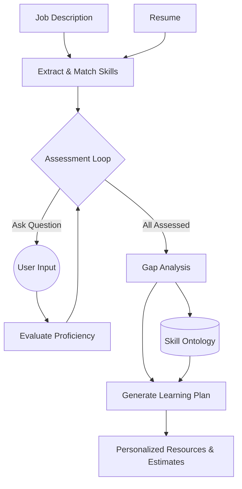

# 🚀 TalentGraph AI: Intelligent Job Fit & Skill Assessment

**TalentGraph AI** is an advanced, agentic AI system designed to bridge the gap between job descriptions and candidate potential. By leveraging Large Language Models (LLMs) and structured skill ontologies, it automates the evaluation process, identifies skill gaps, and provides a personalized roadmap for candidate success.

---

## ✨ Key Features

- 📑 **Smart JD-Resume Matching**: Deep semantic analysis of resumes against job descriptions using spaCy and SentenceTransformers.
- 🤖 **Agentic Interviewer**: A conversational AI powered by **LangGraph** that conducts dynamic, contextual technical assessments.
- 🔍 **Skill Gap Identification**: Automatically detects proficiency levels (Low/Medium/High) across technical domains.
- 🗺️ **Personalized Learning Plans**: Generates structured preparation paths using a custom skill ontology, complete with curated resources and time estimates.
- 📊 **Interactive Dashboard**: A sleek Streamlit-based interface for visualizing the assessment flow and results.

---

## 🏗️ System Architecture



---

## 🛠️ Tech Stack

- **Framework**: [LangGraph](https://github.com/langchain-ai/langgraph) for agent orchestration.
- **LLM**: Powered by Groq/LLaMA-3 for high-speed reasoning.
- **NLP**: spaCy, SentenceTransformers (Cosine Similarity).
- **Frontend**: Streamlit for a fast, responsive user interface.
- **State Management**: Persistent graph state for seamless interview transitions.

---

## 🚀 Setup & Local Deployment

### 1. Prerequisites
- Python 3.10+
- [Groq API Key](https://console.groq.com/)

### 2. Installation
```bash
# Clone the repository
git clone https://github.com/yourusername/talentgraph-ai.git
cd talentgraph-ai

# Install dependencies
pip install -r requirements.txt
```

### 3. Environment Configuration
Create a `.env` file in the root directory:
```env
GROQ_API_KEY=your_api_key_here
```

### 4. Run the Application
```bash
streamlit run backend/frontend/app.py
```

---

## 📂 Project Structure
- `backend/agents/`: LangGraph node logic and state definitions.
- `backend/services/`: LLM integrations and utility functions.
- `backend/frontend/`: Streamlit dashboard and pages.
- `sample_data/`: Example JDs and resumes for testing.

---

## 🧠 Core Logic
1. **Semantic Extraction**: Uses LLMs to parse unstructured text into structured skill entities.
2. **Proficiency Scoring**: Evaluates candidate responses using zero-shot classification patterns.
3. **Ontology Mapping**: Cross-references missing skills with a knowledge graph to find prerequisites.

---

*Built with ❤️ for modern talent acquisition.*
